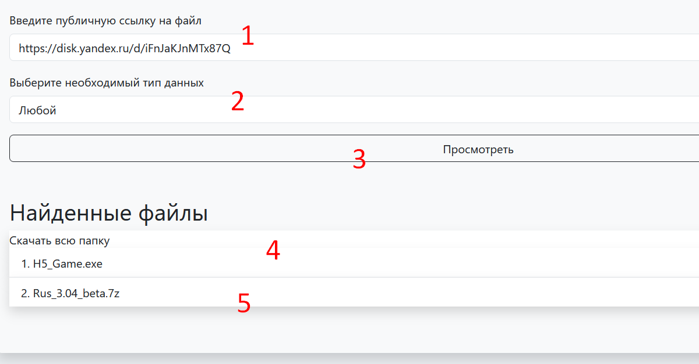

Это тестовая версия приложения, здесь не реализованые некоторые моменты, необходимые для продакшена(но их не было в ТЗ)

Перед запуском приложения необходимо установить зависимости командой
```shell
poetry install
```
Если у вас нет poetry:
```shell
pip install poetry
```
Запуск осуществляется из корневой папки командой
```shell
python run.py
```
Основная страница приложения открывается по адресу
http://127.0.0.1:5000/v1/yandex_disc/

1. Поле для ввода публичного ключа
2. Выбор отображаемого типа данных
3. Кнопка подтверждающая поиск
4. Кнопка для скачивания всей папки
5. При нажатии каждой кнопки происходит скачивание
